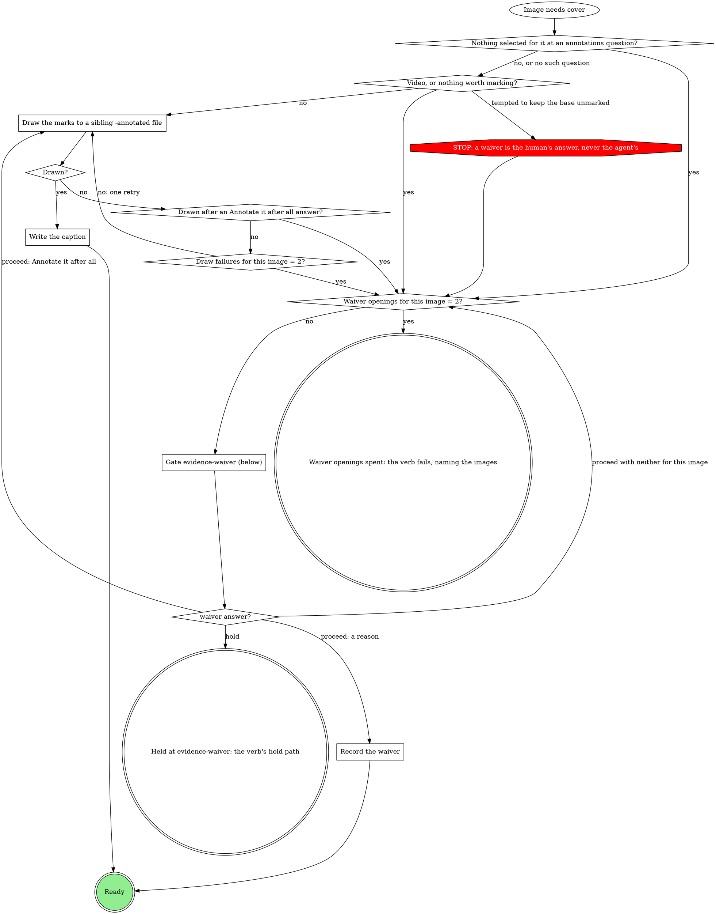

# Evidence record

The `evidence` run field is the record of what this run verified, and the
only list of what may leave the machine as evidence. Every verb that
captures, records or uploads evidence follows this page.

## The record

`evidence` holds `evidence@2` JSON:

```json
{
  "v": 2,
  "cases": [
    {
      "id": "retry-badge",
      "label": "Retry badge on the job row",
      "before": { "path": "/abs/before.png", "annotated": "/abs/before-annotated.png", "caption": "Red box: the badge reads 0" },
      "after": {
        "light": { "path": "/abs/after-light.png", "annotated": "/abs/after-light-annotated.png", "caption": "Arrow: the badge reads 3" },
        "dark": { "path": "/abs/after-dark.png", "waiver": "Same marks as light; only the theme differs" }
      }
    }
  ],
  "url": "https://..."
}
```

- One case per thing verified, in the order a reader should see them.
  `id` is a stable slug matching `^[a-z0-9][a-z0-9-]{0,63}$` that never changes once written; `label` is what a reader
  sees.
- A case has a `before`, an `after`, or both. A slot is one image, or a
  `{light, dark}` pair only when the plan or the domain says the run's
  theme matters.
- Every image is **annotated** (`annotated` plus a `caption` naming what
  the marks point at) or **waived** (its own `waiver`, or its case's).
  Nothing else is valid. A case-level `waiver` covers only the images the
  case holds when it is written, never one added later.
- Paths are absolute. Unbound, files live under
  `~/.mattstack/work/<run id>/evidence/`.
- `<run id>` is the path segment before `/state.db` in the `runDb` this
  verb carries.
- `transcript`, `url` and `attach` are run-level. `transcript` is the
  absolute path of a text file (test output, a CLI transcript) under the
  run's evidence folder; it is never uploaded and needs no caption or
  waiver. `{"plan": "none"}` stays the no-evidence value.
- A run with a text capture and no image at all is not `evidence@2`: its
  value is `{"plan": "text", "transcript": "<absolute path>"}`, plus
  `"url"` when a ticket location also exists. A run with images and a
  transcript carries `transcript` as a run-level key of the v2 record.

## Annotate or waive each image the record does not yet cover



Run it for every image the record does not yet cover: a new capture, an
image a v1 record carried raw, an image the validator or the upload check
named. When several images need the gate in one pass, they share one
opening.

### Draw the marks to a sibling -annotated file

The domain's method, else the `annotating-screenshots` skill. Mark what a
reviewer must look at on a dense page: the changed value, the control, the
missing element. Write the copy beside the base as `<name>-annotated.<ext>`.
A gate that asks which marks to draw (`evidence-attach`, a domain form)
decides the marks; otherwise draw the ones you would propose.

### Write the caption

One short line naming what each mark points at: "Red box: the badge reads
3; arrow: the retry button". It goes on the image as `caption`.

### Gate evidence-waiver (below)

Scope `evidence-waiver:<stage>:<n>`, where `<n>` is the count of
`evidence-waiver` gates this stage pass has opened, starting at 1. One
sentence above the form: which
images need a waiver and why (nothing selected, two failed draws, nothing
worth marking, a video).

| Question | Options (recommended first) | Shown when |
|---|---|---|
| `waiver-<case>-<slot>[-<theme>]` | **`<your proposed reason>` (Recommended)** / **Annotate it after all**, with free text for a reason in the human's words | per image; the second opening for an image drops **Annotate it after all** |
| `waiver-<case>` | the same options, one reason for the whole case | instead of the per-image questions when every image in the case needs one |
| `next` | **Proceed** / **Hold** | always |

Selection: `{"waivers":{"<case>/<slot>[/<theme>]":"<reason>|annotate","<case>":"<reason>|annotate"},"next":"proceed|hold","note":"<their words or null>"}`.
A reason typed as free text is the reason, word for word.

### Record the waiver

The reason goes on the image as `waiver`, or on the case as `waiver` when
the answer was one reason for the whole case.

## Merge into the record

Read `evidence` with `run_field_get`, then:

| What it holds | Do |
|---|---|
| `evidence@2` | Add each new case; an AFTER for an existing case's `id` sets that case's `after`. If that case carries a case `waiver`, first move it onto each of the case's existing images with neither an `annotated` copy nor its own `waiver`, as an image `waiver`, delete the case's `waiver` key, then set `after`; the new image goes through "Annotate or waive" like any other. Keep every other case and key. |
| `evidence@1` (`"v": 1`) | Convert it to one case: `id` `case`, `label` = its `case` text or `Evidence`, `before` = `{path: before}` plus `annotated: beforeAnnotated` only when that is set, and `after` likewise when present (never `"annotated": null`); keep `transcript`, `url` and `attach`. Each annotated image gets a caption (write it; no gate). Each raw image is not yet covered. |
| unset (the read errors), `-`, `{"plan": "none"}` | Start a new record. |
| other JSON with a `url` or a `transcript` (such as `{"plan": "ticket", "url": ...}` or `{"plan": "text", "transcript": ...}`) | Start a new record and keep its `url` and `transcript` as run-level keys. |
| any other text (legacy links) | Start a new record and carry the old text in `attach`, so the description still shows it. |

## Write before upload

Write the merged record with `run_field_set {key: evidence, value: <the
evidence@2 JSON>, stage}` before any of its images upload. `value` is a
string: the JSON serialized as one string, never an object. The write is
refused when an image is neither annotated nor waived, and the refusal names
it: send that image through "Annotate or waive" and write again. A second
refusal in one pass fails the verb with the message quoted.

## Upload only what the record allows

Upload every `annotated` path and every waived image's `path`, and nothing
else: never the base of an annotated image, never a file the record does
not list. Each upload is `mr_upload {mrUrl, path, runId: <run id>}`. A
refusal saying the file is not in the record, or is the raw capture of an
annotated image, means the record is wrong, not the roots. Fix the record
once ("Annotate or waive", then "Write before upload") and retry. A second
such refusal goes to the verb's upload off-script gate. Copying the file
somewhere else, or dropping `runId`, is never the fix.

## The evidence section of the description

The section replaces any evidence block an earlier stage wrote into the
description; it never keeps that block and appends a second one. Build it
from the record, one block per case, one markdown entry per file:

```markdown
**Retry badge on the job row**

- Before: 
  Caption: Red box: the badge reads 0
- After (light): 
  Caption: Arrow: the badge reads 3
- After (dark): 
  Waived: Same marks as light; only the theme differs
```

A case waiver prints once, as `Waived: <reason>` under the label. Where
nothing uploaded (GitHub, a file the human chose to link at the off-script
gate), the line carries the local path instead. After the case blocks,
print `Transcript: <its local path>` when `transcript` is set (it is never
uploaded), `Ticket: <url>` when `url` is set, and the part of `attach`
that no case image covers (legacy links); `attach` markdown for a file a
case already shows never prints twice. The domain's template and heading rules decide where
the section sits and what it is called, never whether a caption or a
waiver reason appears.

## Domain precedence

A domain rule that keeps a base capture with no waiver, uploads a
capture the record does not list, or uploads without `runId`, is
overridden by this page, the way a
STOP node overrides a domain step.
