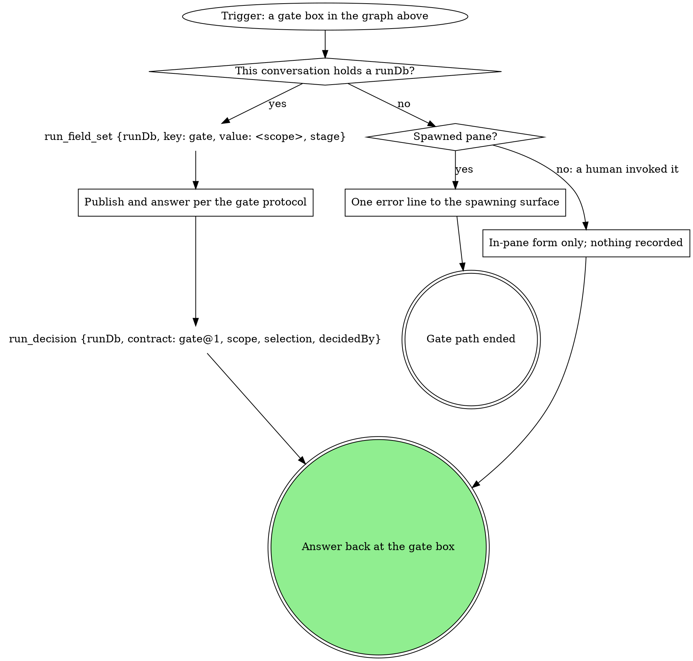

# checkout

Get a teammate's branch into a local worktree so you can read or test it --
this is a review checkout, not the start of your own work.

```dot
digraph checkout {
    rankdir=TB;

    "Trigger: a teammate's branch to check out" [shape=ellipse];
    "git remote get-url origin" [shape=plaintext];
    "What was given?" [shape=diamond];
    "MR forge host?" [shape=diamond];
    "mr_view {repoName, mrUrl or iid}" [shape=plaintext];
    "gh pr view <ref>" [shape=plaintext];
    "Ticket forge host?" [shape=diamond];
    "mr_list {repoName, search: <ticket id>, state: all, limit: 200}" [shape=plaintext];
    "gh pr list --search <id>" [shape=plaintext];
    "Search returned a row naming the ticket?" [shape=diamond];
    "mr_list {repoName, state: all, limit: 200}" [shape=plaintext];
    "STOP: GitLab reads go through the read tools or gitlab_get" [shape=octagon style=filled fillcolor=red fontcolor=white];
    "STOP: GitLab ticket searches go through the read tools or gitlab_get" [shape=octagon style=filled fillcolor=red fontcolor=white];
    "Pick the branch from the result" [shape=box];
    "Exactly one branch, from a complete read?" [shape=diamond];
    "Gate clarify: which branch" [shape=box];
    "branch answer?" [shape=diamond];
    "Clarify rounds = 2?" [shape=diamond];
    "git worktree list" [shape=plaintext];
    "Branch already checked out?" [shape=diamond];
    "worktree_provision {repoName, branch}" [shape=plaintext];
    "worktree_provision result?" [shape=diamond];
    "Argument fixed once already?" [shape=diamond];
    "Fix the named argument" [shape=box];
    "STOP: worktrees only through worktree_provision" [shape=octagon style=filled fillcolor=red fontcolor=white];
    "STOP: stay put; report the path" [shape=octagon style=filled fillcolor=red fontcolor=white];
    "Off-script gate" [shape=box];
    "off-script answer?" [shape=diamond];
    "Make the recorded move once" [shape=box];
    "Recorded move succeeded?" [shape=diamond];
    "Off-script rounds = 2?" [shape=diamond];
    "Report the path and whose branch it is" [shape=box];
    "Unresolved: reported" [shape=doublecircle];
    "Provision refused: reported" [shape=doublecircle];
    "Held: end the turn naming the gate" [shape=doublecircle];
    "Checked out: path reported" [shape=doublecircle style=filled fillcolor=lightgreen];

    "Trigger: a teammate's branch to check out" -> "git remote get-url origin";
    "git remote get-url origin" -> "What was given?";
    "What was given?" -> "git worktree list" [label="a branch name: use it verbatim"];
    "What was given?" -> "MR forge host?" [label="an MR/PR link, !iid, or number"];
    "What was given?" -> "Ticket forge host?" [label="a ticket id"];
    "MR forge host?" -> "mr_view {repoName, mrUrl or iid}" [label="GitLab"];
    "MR forge host?" -> "gh pr view <ref>" [label="GitHub"];
    "MR forge host?" -> "STOP: GitLab reads go through the read tools or gitlab_get" [label="tempted to use the GitLab CLI"];
    "STOP: GitLab reads go through the read tools or gitlab_get" -> "mr_view {repoName, mrUrl or iid}";
    "Ticket forge host?" -> "mr_list {repoName, search: <ticket id>, state: all, limit: 200}" [label="GitLab"];
    "Ticket forge host?" -> "gh pr list --search <id>" [label="GitHub"];
    "Ticket forge host?" -> "STOP: GitLab ticket searches go through the read tools or gitlab_get" [label="tempted to use the GitLab CLI"];
    "STOP: GitLab ticket searches go through the read tools or gitlab_get" -> "mr_list {repoName, search: <ticket id>, state: all, limit: 200}";
    "mr_view {repoName, mrUrl or iid}" -> "Pick the branch from the result";
    "gh pr view <ref>" -> "Pick the branch from the result";
    "mr_list {repoName, search: <ticket id>, state: all, limit: 200}" -> "Search returned a row naming the ticket?";
    "Search returned a row naming the ticket?" -> "Pick the branch from the result" [label="yes"];
    "Search returned a row naming the ticket?" -> "mr_list {repoName, state: all, limit: 200}" [label="no"];
    "Search returned a row naming the ticket?" -> "Gate clarify: which branch" [label="a GitLab error: quoted in the gate's sentence"];
    "mr_list {repoName, state: all, limit: 200}" -> "Pick the branch from the result";
    "gh pr list --search <id>" -> "Pick the branch from the result";
    "Pick the branch from the result" -> "Exactly one branch, from a complete read?";
    "Exactly one branch, from a complete read?" -> "git worktree list" [label="yes"];
    "Exactly one branch, from a complete read?" -> "Gate clarify: which branch" [label="no: several, none, a GitLab error, or a truncated read"];
    "Gate clarify: which branch" -> "branch answer?";
    "branch answer?" -> "git worktree list" [label="a candidate"];
    "branch answer?" -> "Clarify rounds = 2?" [label="their text"];
    "branch answer?" -> "Held: end the turn naming the gate" [label="hold"];
    "Clarify rounds = 2?" -> "What was given?" [label="no: resolve their text"];
    "Clarify rounds = 2?" -> "Unresolved: reported" [label="yes"];
    "git worktree list" -> "Branch already checked out?";
    "Branch already checked out?" -> "Report the path and whose branch it is" [label="yes: point there"];
    "Branch already checked out?" -> "worktree_provision {repoName, branch}" [label="no"];
    "worktree_provision {repoName, branch}" -> "worktree_provision result?";
    "worktree_provision result?" -> "Report the path and whose branch it is" [label="ok: keep its path"];
    "worktree_provision result?" -> "Argument fixed once already?" [label="an argument error"];
    "worktree_provision result?" -> "STOP: worktrees only through worktree_provision" [label="daemon unreachable, or repo unknown to rt"];
    "worktree_provision result?" -> "STOP: stay put; report the path" [label="tempted to enter the worktree"];
    "worktree_provision result?" -> "Provision refused: reported" [label="any other error"];
    "STOP: stay put; report the path" -> "Report the path and whose branch it is";
    "Argument fixed once already?" -> "Fix the named argument" [label="no"];
    "Argument fixed once already?" -> "STOP: worktrees only through worktree_provision" [label="yes"];
    "Fix the named argument" -> "worktree_provision {repoName, branch}";
    "STOP: worktrees only through worktree_provision" -> "Off-script gate";
    "Off-script gate" -> "off-script answer?";
    "off-script answer?" -> "Make the recorded move once" [label="take"];
    "off-script answer?" -> "Off-script rounds = 2?" [label="iterate: the human fixed it, retry"];
    "off-script answer?" -> "Provision refused: reported" [label="hand back"];
    "off-script answer?" -> "Held: end the turn naming the gate" [label="hold"];
    "Off-script rounds = 2?" -> "worktree_provision {repoName, branch}" [label="no"];
    "Off-script rounds = 2?" -> "Provision refused: reported" [label="yes"];
    "Make the recorded move once" -> "Recorded move succeeded?";
    "Recorded move succeeded?" -> "Report the path and whose branch it is" [label="yes"];
    "Recorded move succeeded?" -> "Provision refused: reported" [label="no"];
    "Report the path and whose branch it is" -> "Checked out: path reported";
}
```

### Pick the branch from the result

The origin URL decides the forge host. Read the source branch from the
result. The GitLab tools and `worktree_provision` take `repoName` = the
current checkout's absolute path; `worktree_provision` takes `branch` = the picked branch (a given
branch name verbatim); `mr_view` takes `mrUrl` = the link, or `iid` = the
number. For a ticket id, `mr_list` takes `search` = the id and `state`
`all` and `limit` 200, which asks GitLab for every MR whose title or description carries
it, by any author; keep the rows whose `sourceBranch` (GitHub: head
branch) or `title` carries the id. GitLab's `search` never looks at the
source branch, so when no row names the ticket, make one more read:
`mr_list` with `state` `all`, `limit` 200 and no filter, keeping the rows whose
`sourceBranch` carries the id by filtering the result yourself (the tool's
`sourceBranch` filter needs an exact name). Either `mr_list` result can carry `truncated: true`, meaning GitLab held
more rows than the 200 returned. When either result is truncated and no
row has been chosen, the pick is not safe: go to the clarify gate with one
sentence saying the search was cut at 200 rows and naming what was found.
When exactly one row matched before the cut, the sentence says more rows
exist, and the branch is not picked silently. An `mr_view` or
`mr_list` error is the error text, usually GitLab's: it goes to the clarify gate's
sentence, quoted. No row after both reads means none of the rows GitLab
returned carries the ticket, not that no MR exists.
A fact the read tools do not return is read as in "Reading a GitLab fact
no read tool returns".

### Reading a GitLab fact no read tool returns

At any step of this checkout, a GitLab fact the read tools do not return
is read with `gitlab_get {repoName, path, query}`: `repoName` = the
current checkout's absolute path, `path` relative to the API root with
`:id` for this project, `query` the filters, for example `path`
`projects/:id/repository/branches` with `query` `{search: <ticket id>}`
(a ticket with a branch but no MR). The read is part of the step that
needs it, not an off-script move, so it opens no gate. A GitLab error is
quoted as GitLab wrote it. Its refusal of a credential path is final.

### Gate clarify: which branch

Scope `clarify`. One sentence naming the candidates with each one's state
(opened, merged, closed), or quoting the GitLab error when a read failed,
or saying the search was cut at 200 rows when a read was truncated, then the questions, each its own question:

- `branch`: one option per candidate, or their text
- `next`: **Proceed** (recommended) / **Hold**

Selection `{"branch":"<picked>"}`. Their text goes back to "What was
given?" and resolves again; the second text answer ends at **Unresolved:
reported**, naming what was tried.

Hold: when this conversation holds a run's `runDb`, record
`hold:<run.current_stage>:<attempt>` (`run_decision` with
`contract` `gate@1`, `scope` `hold:<run.current_stage>:<attempt>`,
`selection` `{"reason":"<their words>"}`, `decidedBy` `<the answer's
by>`), then `run_field_set` with `key` `hold`, `value` `<their words>`,
`stage` `<run.current_stage>`, and end the turn. With no run, Hold ends the
turn and makes no `run_*` call.

{{include:spawned-no-run-guard}}

Never a guess.

### Fix the named argument

Fix only the form of the argument the error names (for example a
`repoName` that is not an absolute path: pass the current checkout's
absolute path; or a malformed branch string), then call
`worktree_provision` once more. Never pick a different branch or repo, and
never start, restart or replace the daemon. A branch the error says does
not exist is not an argument error: like any other error the graph does not
name, it ends at **Provision refused: reported**, quoting the error. A
daemon that is down or a repo rt does not know goes to the off-script gate,
not here.

### Off-script gate

Scope `off-script:<run.current_stage>:<n>`, `n` counting from 1 per
off-script round in this run; with no run, per the gate steps. The
context sentence quotes the `worktree_provision` error. The
questions, each its own question:

- `action`: **Take the proposed move** (the value spells the move in full)
  / **Hand back**
- `next`: **Proceed** (recommended) / **Iterate here** / **Hold**

Selection `{"move":"<the move>","why":"<the refusal>","action":"take|handback","next":"proceed|iterate|hold","note":"<their words or null>"}`.
Read `next` first: **Hold** ends the turn with no move made; **Iterate
here** means the human fixed the cause (started the daemon, registered the
repo) and wants `worktree_provision` retried, and it ignores `action`; only
**Proceed** applies `action` (take or hand back). The proposed
move is one plain-git worktree for the branch at a path the value names;
retrying the refused tool is **Iterate here**, never **Take**. A plain-git
worktree is a move only the human's **Take** can authorize; never make one
on any other answer. **Provision refused: reported** quotes the
`worktree_provision` error.

### Make the recorded move once

Exactly the move the selection recorded, once. The move must produce the
worktree path; an answer that only fixes the cause ("I started the daemon,
go ahead") is **Iterate here**, not **Take**. Its result decides the next
node: success goes to the report with the path it made; a failure is
reported, never a second off-script gate.

### Report the path and whose branch it is

Report the path (the `path` `worktree_provision` returned, the worktree
`git worktree list` already showed, or the one the recorded move made) and
that the branch is checked out there. State whose branch it is. Do not
enter the worktree, whatever the tool suggests: a review checkout leaves
the session where it is.

## Safety

- Never commit or push on the checked-out branch -- it belongs to someone
  else.
- State plainly whose branch this is when you report the result.

## Gates

Every gate box above runs this graph.

### Publish and answer per the gate protocol

If a rule below asks for a move this graph marks STOP, take the off-script edge instead.

{{include:gate-protocol}}

### One error line to the spawning surface

The guard text under **Gate clarify: which branch** says what the line is
and where it goes; the off-script gate sends the same line. The gate path
ends there.

### In-pane form only; nothing recorded

A human invocation with no run gets the same form in the pane, and no
`run_*` call is made.
