# stage: evidence

{{stage.fields}}

Run state: the orchestrator opens and closes this stage, so never write
`run_stage` `start` or `done` here. Read consumes with `run_field_get`,
write `evidence` with `run_field_set` (`stage: "evidence"`) the moment it
exists, and on failure write `run_stage {action: fail, stage: "evidence",
reason, detailPath}` with `detailPath` = whatever was captured so far.

Capture the BEFORE now, before implementation changes the surface.

```dot
digraph evidence {
    rankdir=TB;

    "Evidence stage entered" [shape=ellipse];
    "run_field_get {key: evidence-plan}; run_field_get {key: worktree}" [shape=plaintext];
    "evidence-plan starts with none?" [shape=diamond];
    "run_field_set {key: evidence, value: {\"plan\": \"none\"}, stage: evidence}" [shape=plaintext];
    "Run the domain steps before the gate (none when unbound)" [shape=box];
    "Domain needs an rt read (ports, endpoints)?" [shape=diamond];
    "rt_verb {args: [<verb>, ...]}" [shape=plaintext];
    "STOP: rt reads go through rt_verb, never rt on Bash" [shape=octagon style=filled fillcolor=red fontcolor=white];
    "Intake questions declared, or source not local?" [shape=diamond];
    "Gate evidence (table below)" [shape=box];
    "evidence answer?" [shape=diamond];
    "Ticket already shows the broken state?" [shape=diamond];
    "Record the ticket's location as the BEFORE" [shape=box];
    "Capture the BEFORE for the next case" [shape=box];
    "Captured?" [shape=diamond];
    "Attempts for this case = 3?" [shape=diamond];
    "Every planned case captured or located?" [shape=diamond];
    "Pick the next source or view" [shape=box];
    "Same source the gate recorded?" [shape=diamond];
    "STOP: a new data source is an off-script move" [shape=octagon style=filled fillcolor=red fontcolor=white];
    "Off-script gate (gate-protocol, scope off-script:evidence:<n>)" [shape=box];
    "off-script answer?" [shape=diamond];
    "Off-script rounds = 2?" [shape=diamond];
    "Domain attaches evidence to an MR here?" [shape=diamond];
    "run_field_get {key: branch}" [shape=plaintext];
    "mr_for_branch {repoName: <worktree>, branches: [<branch>]}" [shape=plaintext];
    "Open MR on the branch?" [shape=diamond];
    "Gate evidence-attach (table below)" [shape=box];
    "attach answer?" [shape=diamond];
    "mr_upload {mrUrl, path, runId} per uploadable file; keep each markdown" [shape=plaintext];
    "Annotate or waive each image the record does not yet cover (evidence-record)" [shape=box];
    "Annotate or waive outcome?" [shape=diamond];
    "Any image to record?" [shape=diamond];
    "run_field_set {key: evidence, value: {\"plan\": \"ticket\", \"url\": <the ticket location>}, stage: evidence}" [shape=plaintext];
    "run_field_set {key: evidence, value: {\"plan\": \"text\", \"transcript\": <absolute path>}, stage: evidence}" [shape=plaintext];
    "evidence write result?" [shape=diamond];
    "Validator refusals = 2?" [shape=diamond];
    "Attach now answered?" [shape=diamond];
    "Record fixed once already?" [shape=diamond];
    "mr_upload result?" [shape=diamond];
    "Upload retried with a corrected path?" [shape=diamond];
    "mr_upload {mrUrl, path: <the corrected absolute path>, runId}" [shape=plaintext];
    "STOP: upload only with mr_upload; another route is off-script" [shape=octagon style=filled fillcolor=red fontcolor=white];
    "Off-script gate: mr_upload refused (gate-protocol, scope off-script:evidence:<n>)" [shape=box];
    "upload off-script answer?" [shape=diamond];
    "Upload off-script rounds = 2?" [shape=diamond];
    "Timed-out upload retried once?" [shape=diamond];
    "mr_upload {mrUrl, path: <the timed-out file>, runId}" [shape=plaintext];
    "mr_view {mrUrl}" [shape=plaintext];
    "mr_update {mrUrl, description: <the body read back, its evidence section replaced by the record's>}" [shape=plaintext];
    "run_field_set {key: evidence, value: <evidence@2 JSON>, stage: evidence}" [shape=plaintext];
    "run_field_set {key: evidence, value: <the record plus attach>, stage: evidence}" [shape=plaintext];
    "run_stage {action: fail, stage: evidence, reason, detailPath}" [shape=plaintext];
    "run_decision {contract: gate@1, scope: hold:evidence:<attempt>, selection: {reason}, decidedBy}" [shape=plaintext];
    "run_field_set {key: hold, value: <their words, or held>, stage: evidence}" [shape=plaintext];
    "Held: end the turn naming run and stage" [shape=doublecircle];
    "Stage failed" [shape=doublecircle];
    "Evidence done: return to the orchestrator" [shape=doublecircle style=filled fillcolor=lightgreen];

    "Evidence stage entered" -> "run_field_get {key: evidence-plan}; run_field_get {key: worktree}";
    "run_field_get {key: evidence-plan}; run_field_get {key: worktree}" -> "evidence-plan starts with none?";
    "evidence-plan starts with none?" -> "run_field_set {key: evidence, value: {\"plan\": \"none\"}, stage: evidence}" [label="yes"];
    "evidence-plan starts with none?" -> "Run the domain steps before the gate (none when unbound)" [label="no"];
    "run_field_set {key: evidence, value: {\"plan\": \"none\"}, stage: evidence}" -> "Evidence done: return to the orchestrator";
    "Run the domain steps before the gate (none when unbound)" -> "Domain needs an rt read (ports, endpoints)?";
    "Domain needs an rt read (ports, endpoints)?" -> "rt_verb {args: [<verb>, ...]}" [label="yes"];
    "Domain needs an rt read (ports, endpoints)?" -> "STOP: rt reads go through rt_verb, never rt on Bash" [label="tempted to run it on Bash"];
    "Domain needs an rt read (ports, endpoints)?" -> "Intake questions declared, or source not local?" [label="no"];
    "STOP: rt reads go through rt_verb, never rt on Bash" -> "rt_verb {args: [<verb>, ...]}";
    "rt_verb {args: [<verb>, ...]}" -> "Intake questions declared, or source not local?";
    "Intake questions declared, or source not local?" -> "Gate evidence (table below)" [label="yes"];
    "Intake questions declared, or source not local?" -> "Ticket already shows the broken state?" [label="no"];
    "Gate evidence (table below)" -> "evidence answer?";
    "evidence answer?" -> "Ticket already shows the broken state?" [label="proceed: intake and source recorded"];
    "evidence answer?" -> "Gate evidence (table below)" [label="iterate: re-ask with their note"];
    "evidence answer?" -> "run_decision {contract: gate@1, scope: hold:evidence:<attempt>, selection: {reason}, decidedBy}" [label="hold"];
    "evidence answer?" -> "run_stage {action: fail, stage: evidence, reason, detailPath}" [label="hand back: detailPath holds what was captured"];
    "Ticket already shows the broken state?" -> "Record the ticket's location as the BEFORE" [label="yes"];
    "Ticket already shows the broken state?" -> "Capture the BEFORE for the next case" [label="no"];
    "Record the ticket's location as the BEFORE" -> "Every planned case captured or located?";
    "Every planned case captured or located?" -> "Ticket already shows the broken state?" [label="no"];
    "Every planned case captured or located?" -> "Domain attaches evidence to an MR here?" [label="yes"];
    "Capture the BEFORE for the next case" -> "Captured?";
    "Captured?" -> "Every planned case captured or located?" [label="yes"];
    "Captured?" -> "Attempts for this case = 3?" [label="no"];
    "Attempts for this case = 3?" -> "Pick the next source or view" [label="no"];
    "Attempts for this case = 3?" -> "Gate evidence (table below)" [label="yes: reopen with what was tried"];
    "Pick the next source or view" -> "Same source the gate recorded?";
    "Same source the gate recorded?" -> "Capture the BEFORE for the next case" [label="yes"];
    "Same source the gate recorded?" -> "STOP: a new data source is an off-script move" [label="no"];
    "STOP: a new data source is an off-script move" -> "Off-script gate (gate-protocol, scope off-script:evidence:<n>)";
    "Off-script gate (gate-protocol, scope off-script:evidence:<n>)" -> "off-script answer?";
    "off-script answer?" -> "Capture the BEFORE for the next case" [label="proceed + take: the proposed source"];
    "off-script answer?" -> "run_stage {action: fail, stage: evidence, reason, detailPath}" [label="proceed + hand back"];
    "off-script answer?" -> "Off-script rounds = 2?" [label="iterate: the human fixed the evidence gate's source, retry it"];
    "off-script answer?" -> "run_decision {contract: gate@1, scope: hold:evidence:<attempt>, selection: {reason}, decidedBy}" [label="hold: no capture made"];
    "Off-script rounds = 2?" -> "Capture the BEFORE for the next case" [label="no: the evidence gate's source"];
    "Off-script rounds = 2?" -> "run_stage {action: fail, stage: evidence, reason, detailPath}" [label="yes: hand back"];
    "Domain attaches evidence to an MR here?" -> "run_field_get {key: branch}" [label="yes"];
    "run_field_get {key: branch}" -> "mr_for_branch {repoName: <worktree>, branches: [<branch>]}";
    "Domain attaches evidence to an MR here?" -> "Annotate or waive each image the record does not yet cover (evidence-record)" [label="no: ship attaches"];
    "mr_for_branch {repoName: <worktree>, branches: [<branch>]}" -> "Open MR on the branch?";
    "Open MR on the branch?" -> "Gate evidence-attach (table below)" [label="yes: keep its url"];
    "Open MR on the branch?" -> "Annotate or waive each image the record does not yet cover (evidence-record)" [label="no: ship attaches later"];
    "Gate evidence-attach (table below)" -> "attach answer?";
    "attach answer?" -> "Annotate or waive each image the record does not yet cover (evidence-record)" [label="attach now"];
    "attach answer?" -> "Annotate or waive each image the record does not yet cover (evidence-record)" [label="hand back the markdown"];
    "attach answer?" -> "run_decision {contract: gate@1, scope: hold:evidence:<attempt>, selection: {reason}, decidedBy}" [label="hold"];
    "run_decision {contract: gate@1, scope: hold:evidence:<attempt>, selection: {reason}, decidedBy}" -> "run_field_set {key: hold, value: <their words, or held>, stage: evidence}";
    "run_field_set {key: hold, value: <their words, or held>, stage: evidence}" -> "Held: end the turn naming run and stage";
    "attach answer?" -> "Gate evidence-attach (table below)" [label="iterate: re-ask with their note"];
    "mr_upload {mrUrl, path, runId} per uploadable file; keep each markdown" -> "mr_upload result?";
    "mr_upload result?" -> "mr_view {mrUrl}" [label="ok: every file uploaded"];
    "mr_upload result?" -> "mr_upload {mrUrl, path, runId} per uploadable file; keep each markdown" [label="ok: files still to upload"];
    "mr_upload result?" -> "Upload retried with a corrected path?" [label="path must be absolute, or file not found"];
    "mr_upload result?" -> "STOP: upload only with mr_upload; another route is off-script" [label="any other refusal: outside the roots, bytes, size"];
    "mr_upload result?" -> "STOP: upload only with mr_upload; another route is off-script" [label="tempted to copy the file into an allowed root, or upload another way"];
    "Upload retried with a corrected path?" -> "mr_upload {mrUrl, path: <the corrected absolute path>, runId}" [label="no: this file's one fix"];
    "Upload retried with a corrected path?" -> "STOP: upload only with mr_upload; another route is off-script" [label="yes"];
    "mr_upload {mrUrl, path: <the corrected absolute path>, runId}" -> "mr_upload result?";
    "mr_upload result?" -> "Timed-out upload retried once?" [label="timed out"];
    "Timed-out upload retried once?" -> "mr_upload {mrUrl, path: <the timed-out file>, runId}" [label="no: retry once, a timed-out upload is safe to repeat"];
    "Timed-out upload retried once?" -> "STOP: upload only with mr_upload; another route is off-script" [label="yes: timed out twice"];
    "mr_upload {mrUrl, path: <the timed-out file>, runId}" -> "mr_upload result?";
    "STOP: upload only with mr_upload; another route is off-script" -> "Off-script gate: mr_upload refused (gate-protocol, scope off-script:evidence:<n>)";
    "Off-script gate: mr_upload refused (gate-protocol, scope off-script:evidence:<n>)" -> "upload off-script answer?";
    "upload off-script answer?" -> "run_field_set {key: evidence, value: <the record plus attach>, stage: evidence}" [label="proceed + take: link the refused files' local paths, ship attaches"];
    "upload off-script answer?" -> "run_stage {action: fail, stage: evidence, reason, detailPath}" [label="proceed + hand back"];
    "upload off-script answer?" -> "Upload off-script rounds = 2?" [label="iterate: the human fixed the cause, retry the upload"];
    "upload off-script answer?" -> "run_decision {contract: gate@1, scope: hold:evidence:<attempt>, selection: {reason}, decidedBy}" [label="hold: nothing linked"];
    "Upload off-script rounds = 2?" -> "mr_upload {mrUrl, path, runId} per uploadable file; keep each markdown" [label="no: retry the refused files"];
    "Upload off-script rounds = 2?" -> "run_stage {action: fail, stage: evidence, reason, detailPath}" [label="yes: hand back, the refusal quoted"];
    "mr_view {mrUrl}" -> "mr_update {mrUrl, description: <the body read back, its evidence section replaced by the record's>}";
    "mr_update {mrUrl, description: <the body read back, its evidence section replaced by the record's>}" -> "run_field_set {key: evidence, value: <the record plus attach>, stage: evidence}";
    "run_field_set {key: evidence, value: <the record plus attach>, stage: evidence}" -> "Evidence done: return to the orchestrator";
    "run_field_set {key: evidence, value: <evidence@2 JSON>, stage: evidence}" -> "evidence write result?";
    "run_stage {action: fail, stage: evidence, reason, detailPath}" -> "Stage failed";
    "Annotate or waive each image the record does not yet cover (evidence-record)" -> "Annotate or waive outcome?";
    "Annotate or waive outcome?" -> "Any image to record?" [label="ready"];
    "Annotate or waive outcome?" -> "run_decision {contract: gate@1, scope: hold:evidence:<attempt>, selection: {reason}, decidedBy}" [label="held at evidence-waiver"];
    "Annotate or waive outcome?" -> "run_stage {action: fail, stage: evidence, reason, detailPath}" [label="waiver openings spent"];
    "Any image to record?" -> "run_field_set {key: evidence, value: <evidence@2 JSON>, stage: evidence}" [label="yes"];
    "Any image to record?" -> "run_field_set {key: evidence, value: {\"plan\": \"ticket\", \"url\": <the ticket location>}, stage: evidence}" [label="no: every BEFORE is the ticket's"];
    "run_field_set {key: evidence, value: {\"plan\": \"ticket\", \"url\": <the ticket location>}, stage: evidence}" -> "Evidence done: return to the orchestrator";
    "Any image to record?" -> "run_field_set {key: evidence, value: {\"plan\": \"text\", \"transcript\": <absolute path>}, stage: evidence}" [label="no: a text capture only"];
    "run_field_set {key: evidence, value: {\"plan\": \"text\", \"transcript\": <absolute path>}, stage: evidence}" -> "Evidence done: return to the orchestrator";
    "evidence write result?" -> "Attach now answered?" [label="ok"];
    "evidence write result?" -> "Validator refusals = 2?" [label="refused: the validator names an image"];
    "evidence write result?" -> "run_stage {action: fail, stage: evidence, reason, detailPath}" [label="any other error: quote it as the reason"];
    "Validator refusals = 2?" -> "Annotate or waive each image the record does not yet cover (evidence-record)" [label="no"];
    "Validator refusals = 2?" -> "run_stage {action: fail, stage: evidence, reason, detailPath}" [label="yes"];
    "Attach now answered?" -> "mr_upload {mrUrl, path, runId} per uploadable file; keep each markdown" [label="yes"];
    "Attach now answered?" -> "Evidence done: return to the orchestrator" [label="no"];
    "mr_upload result?" -> "Record fixed once already?" [label="refused: not in the record, or a raw capture"];
    "Record fixed once already?" -> "Annotate or waive each image the record does not yet cover (evidence-record)" [label="no: fix the named file"];
    "Record fixed once already?" -> "STOP: upload only with mr_upload; another route is off-script" [label="yes"];
}
```

### Run the domain steps before the gate (none when unbound)

The domain's gathering steps: resolving the running app's ports and its
data source, and any other fact the gate's own sentence or the `source`
question needs. Their result decides whether `source` fires below. Any rt
read among them goes through `rt_verb`, never Bash. A GitLab fact these
steps need that no read tool returns is read as in "Reading a GitLab fact
no read tool returns".

### Reading a GitLab fact no read tool returns

At any step of this stage, a GitLab fact the read tools do not return is
read with `gitlab_get {repoName, path}`: `repoName` = the checkout or
tree this stage already targets, `path` relative to the API root with `:id`
for this project, for example `projects/:id/merge_requests/<iid>/notes`.
The read is part of the step that needs it, not an off-script move, so it
opens no gate. A GitLab error is quoted as GitLab wrote it. Its refusal of
a credential path is final.

### Record the ticket's location as the BEFORE

When the ticket already embeds the broken state (a screenshot, a failing
output), that is the before: record where it sits instead of
recapturing. That case has no BEFORE image. Keep the location for the
record's `url`; ship records the case with its AFTER.

### Capture the BEFORE for the next case

The plan names the cases; give each an `id` and a `label` now (see the evidence
record below). The attempt counter is per case.

Follow the domain's capture method for the plan's evidence type. Never
reconstruct a before by reverting code on a running dev server: it
produces stale, false befores. Unbound, capture what a generic toolchain
can (the failing test output, a CLI transcript, or a screenshot the user
provides) and store it under `~/.mattstack/work/<run id>/evidence/`,
where `<run id>` is the `runId` `run_start` returned; `mr_upload` accepts
that folder only for a run that exists. A text capture (test output, a
CLI transcript) is written to a file there; its absolute path is the
record's run-level `transcript`, never uploaded and never waived.

### Pick the next source or view

A capture that failed (a blank page, a missing record, a wrong route)
gets one different attempt per round: another view, another record, the
same source. The counter is attempts for the current case within this pass through the stage.

### Off-script gate: mr_upload refused (gate-protocol, scope off-script:evidence:<n>)

The upload guard refused a file past its one fix; a second timeout on
the same file reaches this gate too (Iterate retries it once the human
has checked the daemon), as does a second refusal that the file is not
in the record or is a raw capture. Scope
`off-script:evidence:<n>`, sharing `n` with the stage's other off-script
gate, `context` quoting the refusal and the path. Take links the refused
files' local paths in the handed-back markdown, while files already
uploaded keep their upload markdown, and ship calls `mr_upload` on the
refused files, where its own upload gate asks again if the guard still
refuses (the human can widen the roots in between); Iterate means the
human moved the file, widened `rt.mcp.uploadRoots` or recaptured. Copying
a file under an allowed root is only ever the human's move: the roots are
the boundary on what leaves the machine.

## What the graph cannot show

- **Off-script answers.** Read `next` first: at the data-source gate, Hold
  ends the turn with no capture made and Iterate means the human fixed the
  evidence gate's source; at the upload gate, Hold ends the turn with
  nothing linked and Iterate retries the upload after the human's fix.
  Iterate ignores `action`; only Proceed applies `action`. Retrying the
  evidence gate's source is Iterate; the proposed new source is only Take;
  retrying `mr_upload` is Iterate, never Take; rounds count per stage
  attempt.

## Gate `evidence` (before any capture)

One sentence above the form: what the plan asks for and what is unknown.

| Question | Options (recommended first) | Shown when |
|---|---|---|
| the domain's intake | as the domain words them; an open-ended one is free text in the form | the domain declares them |
| `source` | **Proceed with `<source>` (Recommended)** / **Switch to local** | the data source is not local |
| `next` | **Proceed** / **Iterate here** / **Hold**, plus **Hand back** once three captures have failed | always |

Selection: `{"intake":{<answers>},"source":"<as confirmed>","next":"proceed|iterate|hold|handback","note":"<their words or null>"}`.
Hand back fails the stage with `detailPath` = what was captured so far.

## Gate `evidence-attach` (the domain attaches here and the lookup found an open MR)

One sentence above the form: what was captured and where it sits.

| Question | Options (recommended first) | Shown when |
|---|---|---|
| `annotations` | the proposed marks per image, multi-select, all pre-selected; an image left with nothing selected goes to the waiver question (evidence record below); split `annotations-1`, ... over 4 | always |
| `attach` | **Hand back the markdown (Recommended)** (ship attaches) / **Attach to the MR now** | always |
| `next` | **Proceed** / **Iterate here** / **Hold** | always |

Selection: `{"annotations":[...],"attach":"now|handback"}`.

| Thought | Reality |
|---|---|
| "I have no concrete case ids to offer, so I'll explain the gap after the form" | An open-ended intake question needs no invented options: it is free text inside the form. Prose after the form is what the gate forbids. |

## Domain rules

The domain rules below supply the capture method, the intake questions
and the attach format. Where a domain step names a move the graph above
marks STOP (an rt command on Bash, a different data source), the STOP node
wins.

{{slot:domain}}

When nothing is inlined above, the graph and the Capture section are the
whole flow.

Finish with `evidence` as `evidence@2` JSON, as the evidence record below
says, written before any upload; a text capture beside the images rides
as its run-level `transcript`. With no plan, write `{"plan": "none"}`; when
every BEFORE is the ticket's, write `{"plan": "ticket", "url": "<where the
ticket shows it>"}`; when the only capture is text, write `{"plan": "text",
"transcript": "<absolute path>"}`, adding `"url"` when a ticket location
also exists. `value` is always the JSON serialized as one string. Ship
adds the AFTERs to the same record.

## Evidence record

{{include:evidence-record}}

## Gate protocol

{{include:gate-protocol}}

## Wrap-up form contract

{{include:wrap-up-form}}
