# Creating a pack

A pack is a plugin in the team's folder of the org repo: a verb roster, a
bindings fragment, and (later) domain fills. `rt skills init` writes all of
it; this skill runs that verb, proves the result, and offers the first
rules. One team folder holds one pack, named after the team: the widgets
team in the acme org has its pack at
`~/.mattstack/orgs/acme/mattstack/teams/widgets/plugin/`, and the org
clone's `.claude-plugin/marketplace.json` lists it with the source
`./mattstack/teams/widgets/plugin`.

Walk this map to the end; a pack is not done until it is published. A
successful init publishes the new pack itself: it commits the pack, the
team's claim and the marketplace entry in one commit and pushes the org
clone, and says how that went in the envelope's `published`. Whenever init
stops short of that (a failed share, or a failure after it wrote the pack),
`rt team publish --team <org>` finishes it: init remembered the share on
this Mac before it compiled.

```dot
digraph create_pack {
    rankdir=TB;

    "Trigger: a team wants the pipeline on a repo with no pack" [shape=ellipse];
    "rt_verb {args: [\"daemon\", \"status\"]}" [shape=plaintext];
    "claude plugin list --json" [shape=plaintext];
    "git remote get-url origin" [shape=plaintext];
    "Every prerequisite passes?" [shape=diamond];
    "Name each miss and the command that installs it" [shape=box];
    "STOP: never improvise a substitute" [shape=octagon style=filled fillcolor=red fontcolor=white];
    "Team and its org known?" [shape=diamond];
    "Ask the author which team" [shape=box];
    "The team's folder exists?" [shape=diamond];
    "rt team create <Name> --remote <url> --first-team <team>" [shape=plaintext];
    "Author is an org admin?" [shape=diamond];
    "rt team add <team> --owner <username>" [shape=plaintext];
    "Ask an org admin to add the team" [shape=box];
    "rt skills init --json --team <team> --repo <repo-path>" [shape=plaintext];
    "Envelope?" [shape=diamond];
    "published.pushed?" [shape=diamond];
    "Relay published.reason" [shape=box];
    "rt team publish --team <org> --json" [shape=plaintext];
    "Publish envelope?" [shape=diamond];
    "Pulled for this share already?" [shape=diamond];
    "rt team pull --team <org> --json" [shape=plaintext];
    "Gate: share did not land" [shape=box];
    "Relay error.message verbatim" [shape=box];
    "Refusal code?" [shape=diamond];
    "Init runs = 2?" [shape=diamond];
    "Gate: init budget spent" [shape=box];
    "Relay error.message and error.wrote" [shape=box];
    "write-failed?" [shape=diamond];
    "Removed the pack dir once already?" [shape=diamond];
    "Gate: write failed after cleanup" [shape=box];
    "Remove the pack dir" [shape=box];
    "STOP: never re-run init on a written pack" [shape=octagon style=filled fillcolor=red fontcolor=white];
    "Follow the printed remedy" [shape=box];
    "The remedy completed the pack?" [shape=diamond];
    "Gate: remedy did not complete the pack" [shape=box];
    "In a herdr pane?" [shape=diamond];
    "rt pane send self --text \"/reload-plugins\" --then \"Continue: <tryNext> with a small real ticket\"" [shape=plaintext];
    "End the turn" [shape=box];
    "The queued Continue line resumes this pane" [shape=ellipse];
    "Run tryNext on a small real ticket" [shape=box];
    "The run reached a CI verdict?" [shape=diamond];
    "Name each fallback the run took" [shape=box];
    "Ask the author to type /reload-plugins, then paste tryNext" [shape=box];
    "Report: scaffolded, proof pending" [shape=box];
    "Ask the first-rules question once" [shape=box];
    "Rules written down?" [shape=diamond];
    "Hand each rule to extending-a-pack, one per round" [shape=box];
    "Say rules can be added any time" [shape=box];
    "Stopped at prerequisites" [shape=doublecircle];
    "Stopped: refusal relayed" [shape=doublecircle];
    "Handed to the author" [shape=doublecircle];
    "Pack published" [shape=doublecircle style=filled fillcolor=lightgreen];

    "Trigger: a team wants the pipeline on a repo with no pack" -> "rt_verb {args: [\"daemon\", \"status\"]}";
    "rt_verb {args: [\"daemon\", \"status\"]}" -> "claude plugin list --json";
    "claude plugin list --json" -> "git remote get-url origin";
    "git remote get-url origin" -> "Every prerequisite passes?";
    "Every prerequisite passes?" -> "Team and its org known?" [label="yes"];
    "Every prerequisite passes?" -> "Name each miss and the command that installs it" [label="no"];
    "Name each miss and the command that installs it" -> "STOP: never improvise a substitute";
    "STOP: never improvise a substitute" -> "Stopped at prerequisites";
    "Team and its org known?" -> "rt skills init --json --team <team> --repo <repo-path>" [label="yes"];
    "Team and its org known?" -> "Ask the author which team" [label="team unclear, or no team folder yet"];
    "Ask the author which team" -> "The team's folder exists?";
    "The team's folder exists?" -> "rt skills init --json --team <team> --repo <repo-path>" [label="yes"];
    "The team's folder exists?" -> "Author is an org admin?" [label="no: the org is on this Mac"];
    "The team's folder exists?" -> "rt team create <Name> --remote <url> --first-team <team>" [label="no org on this Mac: their remote, never an invented one"];
    "Author is an org admin?" -> "rt team add <team> --owner <username>" [label="yes"];
    "Author is an org admin?" -> "Ask an org admin to add the team" [label="no"];
    "Ask an org admin to add the team" -> "Handed to the author";
    "rt team add <team> --owner <username>" -> "rt skills init --json --team <team> --repo <repo-path>";
    "rt team create <Name> --remote <url> --first-team <team>" -> "rt skills init --json --team <team> --repo <repo-path>";
    "rt skills init --json --team <team> --repo <repo-path>" -> "Envelope?";
    "Envelope?" -> "published.pushed?" [label="ok: true"];
    "published.pushed?" -> "In a herdr pane?" [label="true"];
    "published.pushed?" -> "Relay published.reason" [label="false"];
    "Relay published.reason" -> "rt team publish --team <org> --json";
    "rt team publish --team <org> --json" -> "Publish envelope?";
    "Publish envelope?" -> "In a herdr pane?" [label="pushed: true"];
    "Publish envelope?" -> "Pulled for this share already?" [label="error.code org-moved"];
    "Publish envelope?" -> "Gate: share did not land" [label="any other error.code"];
    "Pulled for this share already?" -> "rt team pull --team <org> --json" [label="no"];
    "Pulled for this share already?" -> "Gate: share did not land" [label="yes"];
    "rt team pull --team <org> --json" -> "rt team publish --team <org> --json";
    "Gate: share did not land" -> "rt team publish --team <org> --json" [label="retry: author fixed it"];
    "Gate: share did not land" -> "Handed to the author" [label="author takes over"];
    "Envelope?" -> "Relay error.message verbatim" [label="refused: true"];
    "Envelope?" -> "Relay error.message and error.wrote" [label="refused: false, after a write"];
    "Relay error.message verbatim" -> "Refusal code?";
    "Refusal code?" -> "Init runs = 2?" [label="zone-missing or zone-ambiguous"];
    "Refusal code?" -> "Stopped: refusal relayed" [label="any other code"];
    "Init runs = 2?" -> "Ask the author which team" [label="no"];
    "Init runs = 2?" -> "Gate: init budget spent" [label="yes"];
    "Gate: init budget spent" -> "rt skills init --json --team <team> --repo <repo-path>" [label="retry: author fixed it"];
    "Gate: init budget spent" -> "Handed to the author" [label="author takes over"];
    "Relay error.message and error.wrote" -> "write-failed?";
    "write-failed?" -> "Removed the pack dir once already?" [label="yes"];
    "write-failed?" -> "Follow the printed remedy" [label="no"];
    "write-failed?" -> "STOP: never re-run init on a written pack" [label="tempted to re-run init"];
    "STOP: never re-run init on a written pack" -> "Follow the printed remedy";
    "Removed the pack dir once already?" -> "Remove the pack dir" [label="no"];
    "Removed the pack dir once already?" -> "Gate: write failed after cleanup" [label="yes"];
    "Gate: write failed after cleanup" -> "Remove the pack dir" [label="retry: author fixed it"];
    "Gate: write failed after cleanup" -> "Handed to the author" [label="author takes over"];
    "Remove the pack dir" -> "rt skills init --json --team <team> --repo <repo-path>";
    "Follow the printed remedy" -> "The remedy completed the pack?";
    "The remedy completed the pack?" -> "rt team publish --team <org> --json" [label="yes"];
    "The remedy completed the pack?" -> "Gate: remedy did not complete the pack" [label="no"];
    "Gate: remedy did not complete the pack" -> "Follow the printed remedy" [label="retry with their note"];
    "Gate: remedy did not complete the pack" -> "Handed to the author" [label="author takes over"];
    "In a herdr pane?" -> "rt pane send self --text \"/reload-plugins\" --then \"Continue: <tryNext> with a small real ticket\"" [label="yes"];
    "In a herdr pane?" -> "Ask the author to type /reload-plugins, then paste tryNext" [label="no"];
    "rt pane send self --text \"/reload-plugins\" --then \"Continue: <tryNext> with a small real ticket\"" -> "End the turn";
    "End the turn" -> "The queued Continue line resumes this pane" [style=dashed];
    "The queued Continue line resumes this pane" -> "Run tryNext on a small real ticket";
    "Run tryNext on a small real ticket" -> "The run reached a CI verdict?";
    "The run reached a CI verdict?" -> "Name each fallback the run took" [label="yes"];
    "The run reached a CI verdict?" -> "Report: scaffolded, proof pending" [label="no"];
    "Name each fallback the run took" -> "Ask the first-rules question once";
    "Ask the author to type /reload-plugins, then paste tryNext" -> "Report: scaffolded, proof pending";
    "Report: scaffolded, proof pending" -> "Ask the first-rules question once";
    "Ask the first-rules question once" -> "Rules written down?";
    "Rules written down?" -> "Hand each rule to extending-a-pack, one per round" [label="yes"];
    "Rules written down?" -> "Say rules can be added any time" [label="no"];
    "Hand each rule to extending-a-pack, one per round" -> "Pack published";
    "Say rules can be added any time" -> "Pack published";
}
```

## Prerequisites

| check | command | pass |
| --- | --- | --- |
| rt daemon | `rt_verb {args: ["daemon", "status"]}` | `"state":"running"` |
| mattstack plugin | `claude plugin list --json` | an id starting `mattstack@` |
| superpowers | `claude plugin list --json` | an id starting `superpowers@` |
| a GitLab remote | `git remote get-url origin` | host is a GitLab host |

## Steps

### Name each miss and the command that installs it

Report the missing thing and the command that installs it: `rt setup pack`,
run once and not routine, covers only the first three rows. A missing or
non-GitLab `origin` is the author's to fix: name the miss and say the remote
must be the repo on its GitLab host. Never set a remote yourself. Do not
improvise a substitute.

### Ask the author which team

The org repo is cloned at `~/.mattstack/orgs/<org>/` (its
`mattstack/mattstack.jsonc` says `role: org`), and each team is a folder
under its `mattstack/teams/`, named in lowercase letters, digits and
hyphens (`widgets`, `gadgets`). When the team is unclear, ask which team
this is before running anything.

When the org has no folder for the team,
`rt team add <team> --owner <username>` adds one, pack skeleton included,
and init carries that skeleton on. `--owner` is required: the forge
usernames (comma separated) who may change the team's settings and pack,
usually the author. Only an org admin can run it; when you do not know
whether the author is one, ask.

When this Mac has no org at all,
`rt team create <Name> --remote <url> --first-team <team>` makes the org
with the author's team as its first folder (without `--first-team` the
first folder is named after the org). It is a one-time setup call, not
routine, and the remote is an empty repo the org owns. Ask the author for
that URL; never invent one.

### Ask an org admin to add the team

The author is not an org admin, so `rt team add` would be refused. Say the
team needs a folder, give the command an admin runs
(`rt team add <team> --owner <username>`, with the author as owner), and
stop until the folder exists.

### Relay published.reason

`published` is `{ "pushed": false, "reason", "next" }` when the commit or
the push failed. The pack is installed on this Mac but not shared yet. Say
so, relay `published.reason`, and run the publish on Bash:
`rt team publish --team <org> --json` makes the commit init could not, then
pushes. Read its envelope, never its text: `{ "pushed": true, ... }` means
the pack is shared; a failure exits 2 with `{ "error": { "code", "message" } }`.
`org-moved` means someone else pushed first: pull with
`rt team pull --team <org> --json`, then publish again, once.

### Gate: share did not land

Quote the publish envelope's `error.code` and `error.message` and propose
the next move: `team-pull-only` means this Mac may not write the team's
files (an org admin or the team's owner finishes it); `org-moved` after a
pull means the org repo moved again. Never force. Retry: the author fixed
it; run `rt team publish --team <org> --json` again. Takes over: the pack
stays on this Mac for the author to share.

### Relay error.message verbatim

A refusal is `{ "error": { "code", "message", "refused": true } }`, and
nothing was written. Relay `error.message` word for word (it ends with the
command to run, when there is one), then read `error.code`:

- `zone-missing`: no org on this Mac, no team folder yet, or no team by the
  name given. The message's command is the one to run (`rt team add` only
  as an org admin).
- `other-org`: `--zone` named an org other than the one this Mac uses. rt
  works with one org per Mac, so a pack for that org is made from a Mac
  that uses it. Never re-run init without `--zone` to get past this: the
  pack would land in this Mac's org instead.
- `zone-ambiguous`: more than one team could hold the pack; name one with
  `--team`.
- `pack-exists`: this team's pack has already compiled, and init never
  changes it. Rules and verbs go through `mattstack:extending-a-pack`.

### Relay error.message and error.wrote

A post-write failure is
`{ "error": { "code", "message", "refused": false, "wrote": [...] } }`:
init wrote files before it failed. Relay `error.message` and the
`error.wrote` list so the author sees what exists now.

### Remove the pack dir

Only after `write-failed`: that code's remedy is to remove the pack dir and
run init again. Remove the pack dir the `error.wrote` paths sit in, and
nothing else in the org clone.

### Follow the printed remedy

Do exactly what the printed remedy says. Never re-run init on a written
pack. Once the pack compiles and installs, the remedy's last step is
`rt team publish --team <org>`, which shares the pack with its entry; run
it with `--json` and read its envelope as `Relay published.reason` says.

### End the turn

The `rt pane send self` call above is the rt:herdr-inject pattern and has
already queued the reload; end the turn now. `/reload-plugins` loads the new
pack in place.

### Run tryNext on a small real ticket

Run `tryNext` with a small real ticket. "Works" means, after the reload: a
branch or worktree, an APPROACH block printed, a commit, an MR, and a CI
verdict. Every stage runs its generic path; that is the expected shape of a
pack with no fills.

### Name each fallback the run took

Name each fallback in the report, for example: the provisioner did not know
the repo, so the branch was made in the checkout.

The `work` verb's description in `pack/stubs.jsonc` is a placeholder seeded
from the engine. Rewording it in the team's words is the first, smallest
edit; `mattstack:extending-a-pack` covers it.

### Ask the author to type /reload-plugins, then paste tryNext

`/reload-plugins` loads the new pack in the author's session in place.
Then they paste `tryNext` with a small real ticket.

### Report: scaffolded, proof pending

Until the first `/<pack>:work` run has reported back, the pack is
scaffolded, not proven: say "scaffolded, proof pending". When the run in
this pane stopped short of a CI verdict, name the stage it stopped at.
When the author runs it, their reloaded session owns the report. A hand-off
is not a proof.

### Ask the first-rules question once

Ask exactly this:

> Are any of your team's rules already written down (CONTRIBUTING, a review
> checklist, branch rules, a release checklist)?

### Hand each rule to extending-a-pack, one per round

Each yes is one round of `mattstack:extending-a-pack`, one rule per round.

### Say rules can be added any time

No is a complete answer. Say that rules can be added any time with
`mattstack:extending-a-pack`.

### Gate: init budget spent

Quote each init envelope's `error.message` and propose the next move: the
team (and org) to use, or what to clear. Retry: the author fixed it; run
init again, with `Init runs` starting again at zero. Takes over: the author
runs init.

### Gate: write failed after cleanup

Quote both init envelopes' `error.message` and `error.wrote`, and propose
the fix for the write failure (permissions, disk space). Retry: the author
fixed it; remove the pack dir again and run init once more. Takes over: the
author finishes the pack.

### Gate: remedy did not complete the pack

Quote the remedy and what is still missing, and propose the next move.
Retry: follow the remedy again with the author's note, and a remedy that
still leaves the pack incomplete comes back here. Takes over: the pack stays
as init and the remedy left it, for the author.

## What the graph cannot show

- Name the team and the app repo explicitly on init, never relying on the
  current directory. Without `--team`, init takes your own team, else
  detects one (the team that declares this repo, else the one team on the
  host with no compiled pack), which can land the pack in another team's
  folder. rt works with one org per Mac (the first clone by name when a
  Mac has several), so `--zone <org>` only ever names that org.
- The pack binds the repos in its team's `board.projects` (the org's list
  unless the team sets its own), on the org's forge host. Init adds this
  repo to the team's list.
- An ok envelope is `{ "ok": true, ... }` and carries `pack.name`,
  `pack.dir`, `tryNext`, `restartNeeded` and `published`.
  `restartNeeded` is always true; the reload runs in place, never a
  restart.
- At `Pack published`, say that the team's members receive the pack
  through `rt setup` (a Mac installs only its active team's pack). Every
  later change to the pack goes out through the pack's own publish in
  `mattstack:editing-skills` (bump, commit, push, then
  `rt_verb {args: ["skills", "sync", "--pack", "<pack>"]}`), never through
  the daemon or `rt team publish`; a rule made and GREEN in a
  `mattstack:extending-a-pack` round enters it at `What changed?`.

## Writing fills later

Before a fill tells an agent to run a command, open
`${CLAUDE_SKILL_DIR}/../../../attachments/mcp-tools/reference.md` (the
`mcp-tools` reference): every rt call, forge call and git write a pipeline
needs has a tool there, except the few its header lists as staying on Bash
(`git commit` is one). The fill's sentence names that tool (a push is
`git_push {tree: <checkout>}`), not the command, and `rt skills check` <!-- mcp-lint: allow -->
flags the shell form. `rt skills audit --pack <pack>` is the slower read
for plain-words instructions.

A fill or pack skill that describes a process of its own (a trigger, steps,
an end) gets a digraph map per mattstack:process-digraphs. A fill that only
adds rules to an engine's steps keys its sections to that step's node text,
and never adds a move the engine's graph marks STOP.

## Red flags

- Creating directories or `plugin.json` by hand: init writes them.
- Copying another team's pack: its fills carry that team's rules.
- A `.mattstack/skills.jsonc` inside the repo: the compiler reads the
  pack's bindings file at `~/.mattstack/repos/<slug>/packs/<pack>/skills.jsonc`,
  not the repo.
- Writing a fill "to have something there": fills are optional and each one
  is written through `superpowers:writing-skills` when the rule exists.
