# Extending a pack

One ask per round. The ask lands in exactly one of four places; the rule
itself is written by the author, in their words, as a real skill.

**REQUIRED SUB-SKILL:** `superpowers:writing-skills` for every `context`
skill and every fill. Baseline first, then write, then re-run.

Walk this map once per ask; the round is not done until GREEN is recorded or the ask needs no rule.

```dot
digraph extend_pack {
    rankdir=TB;

    "Trigger: a pack exists and should know something new" [shape=ellipse];
    "Sort the ask" [shape=box];
    "Where does the ask land?" [shape=diamond];
    "Add the roster entry in pack/stubs.jsonc" [shape=box];
    "rt_verb {args: [\"skills\", \"surface\", \"set\", \"<verb>\", \"--public\", \"--pack\", \"<pack>\"]}" [shape=plaintext];
    "A shepherdr door?" [shape=diamond];
    "rt_verb {args: [\"skills\", \"bind\", \"shepherdr\", \"tiering\", \"mattstack:model-tiering\", \"--pack\", \"<pack>\"]}" [shape=plaintext];
    "rt_verb {args: [\"skills\", \"bind\", \"shepherdr\", \"strategy\", \"mattstack:execution-strategy\", \"--pack\", \"<pack>\"]}" [shape=plaintext];
    "Reword the description in pack/stubs.jsonc" [shape=box];
    "rt_verb {args: [\"skills\", \"compile\", \"--pack\", \"<pack>\"]}" [shape=plaintext];
    "Compiled after a revision?" [shape=diamond];
    "RED: run the stage or verb without the rule" [shape=box];
    "The miss reproduced?" [shape=diamond];
    "Where does the edit land?" [shape=diamond];
    "STOP: edit the pack source, never compiled output or the cache" [shape=octagon style=filled fillcolor=red fontcolor=white];
    "Write the rule in the author's words" [shape=box];
    "A fill?" [shape=diamond];
    "rt_verb {args: [\"skills\", \"bind\", \"<stage-or-verb>\", \"<slot>\", \"<pack>:<fill>\", \"--pack\", \"<pack>\"]}" [shape=plaintext];
    "Bind result?" [shape=diamond];
    "Bind attempts = 2?" [shape=diamond];
    "Fix what the refusal names" [shape=box];
    "Gate: bind refused twice" [shape=box];
    "Add it to pack/surface.jsonc public" [shape=box];
    "sh ${CLAUDE_PLUGIN_ROOT}/tests/certify.sh <dir> --domain" [shape=plaintext];
    "rt_verb {args: [\"skills\", \"check\", \"--pack\", \"<pack>\"]}" [shape=plaintext];
    "Certify and check pass?" [shape=diamond];
    "Fix rounds = 3?" [shape=diamond];
    "Read what moved on Bash" [shape=box];
    "Fix what failed" [shape=box];
    "Gate: fix rounds spent" [shape=box];
    "Bound a fill this round?" [shape=diamond];
    "The fragment carries the binding?" [shape=diamond];
    "Fragment checks = 2?" [shape=diamond];
    "Gate: fragment still missing the binding" [shape=box];
    "claude --plugin-dir <pack dir>" [shape=plaintext];
    "Re-run the same stage on the same task" [shape=box];
    "The miss is gone?" [shape=diamond];
    "GREEN rounds = 3?" [shape=diamond];
    "Revise the rule" [shape=box];
    "Gate: GREEN rounds spent" [shape=box];
    "No miss: nothing to write" [shape=doublecircle];
    "Handed to the author" [shape=doublecircle];
    "Round done: hand to editing-skills to publish" [shape=doublecircle style=filled fillcolor=lightgreen];

    "Trigger: a pack exists and should know something new" -> "Sort the ask";
    "Sort the ask" -> "Where does the ask land?";
    "Where does the ask land?" -> "Add the roster entry in pack/stubs.jsonc" [label="a new door"];
    "Where does the ask land?" -> "Reword the description in pack/stubs.jsonc" [label="the wording of a verb"];
    "Where does the ask land?" -> "RED: run the stage or verb without the rule" [label="a context rule, or a fill for one stage or verb"];
    "Add the roster entry in pack/stubs.jsonc" -> "rt_verb {args: [\"skills\", \"surface\", \"set\", \"<verb>\", \"--public\", \"--pack\", \"<pack>\"]}";
    "rt_verb {args: [\"skills\", \"surface\", \"set\", \"<verb>\", \"--public\", \"--pack\", \"<pack>\"]}" -> "A shepherdr door?";
    "A shepherdr door?" -> "rt_verb {args: [\"skills\", \"bind\", \"shepherdr\", \"tiering\", \"mattstack:model-tiering\", \"--pack\", \"<pack>\"]}" [label="yes"];
    "A shepherdr door?" -> "rt_verb {args: [\"skills\", \"compile\", \"--pack\", \"<pack>\"]}" [label="no"];
    "rt_verb {args: [\"skills\", \"bind\", \"shepherdr\", \"tiering\", \"mattstack:model-tiering\", \"--pack\", \"<pack>\"]}" -> "rt_verb {args: [\"skills\", \"bind\", \"shepherdr\", \"strategy\", \"mattstack:execution-strategy\", \"--pack\", \"<pack>\"]}";
    "rt_verb {args: [\"skills\", \"bind\", \"shepherdr\", \"strategy\", \"mattstack:execution-strategy\", \"--pack\", \"<pack>\"]}" -> "rt_verb {args: [\"skills\", \"compile\", \"--pack\", \"<pack>\"]}";
    "Reword the description in pack/stubs.jsonc" -> "rt_verb {args: [\"skills\", \"compile\", \"--pack\", \"<pack>\"]}";
    "rt_verb {args: [\"skills\", \"compile\", \"--pack\", \"<pack>\"]}" -> "Compiled after a revision?";
    "Compiled after a revision?" -> "Round done: hand to editing-skills to publish" [label="no"];
    "Compiled after a revision?" -> "sh ${CLAUDE_PLUGIN_ROOT}/tests/certify.sh <dir> --domain" [label="yes: certify and check it"];
    "RED: run the stage or verb without the rule" -> "The miss reproduced?";
    "The miss reproduced?" -> "Where does the edit land?" [label="yes: quote it"];
    "The miss reproduced?" -> "No miss: nothing to write" [label="no"];
    "Where does the edit land?" -> "Write the rule in the author's words" [label="the pack source"];
    "Where does the edit land?" -> "STOP: edit the pack source, never compiled output or the cache" [label="tempted: compiled output or a cache copy"];
    "STOP: edit the pack source, never compiled output or the cache" -> "Write the rule in the author's words";
    "Write the rule in the author's words" -> "A fill?";
    "A fill?" -> "rt_verb {args: [\"skills\", \"bind\", \"<stage-or-verb>\", \"<slot>\", \"<pack>:<fill>\", \"--pack\", \"<pack>\"]}" [label="yes"];
    "A fill?" -> "Add it to pack/surface.jsonc public" [label="no: a context skill"];
    "rt_verb {args: [\"skills\", \"bind\", \"<stage-or-verb>\", \"<slot>\", \"<pack>:<fill>\", \"--pack\", \"<pack>\"]}" -> "Bind result?";
    "Bind result?" -> "sh ${CLAUDE_PLUGIN_ROOT}/tests/certify.sh <dir> --domain" [label="ok"];
    "Bind result?" -> "Bind attempts = 2?" [label="refused"];
    "Bind attempts = 2?" -> "Fix what the refusal names" [label="no"];
    "Bind attempts = 2?" -> "Gate: bind refused twice" [label="yes"];
    "Fix what the refusal names" -> "rt_verb {args: [\"skills\", \"bind\", \"<stage-or-verb>\", \"<slot>\", \"<pack>:<fill>\", \"--pack\", \"<pack>\"]}";
    "Gate: bind refused twice" -> "rt_verb {args: [\"skills\", \"bind\", \"<stage-or-verb>\", \"<slot>\", \"<pack>:<fill>\", \"--pack\", \"<pack>\"]}" [label="retry: author fixed it"];
    "Gate: bind refused twice" -> "Handed to the author" [label="author takes over"];
    "Add it to pack/surface.jsonc public" -> "sh ${CLAUDE_PLUGIN_ROOT}/tests/certify.sh <dir> --domain";
    "sh ${CLAUDE_PLUGIN_ROOT}/tests/certify.sh <dir> --domain" -> "rt_verb {args: [\"skills\", \"check\", \"--pack\", \"<pack>\"]}";
    "rt_verb {args: [\"skills\", \"check\", \"--pack\", \"<pack>\"]}" -> "Certify and check pass?";
    "Certify and check pass?" -> "Bound a fill this round?" [label="yes"];
    "Certify and check pass?" -> "Fix rounds = 3?" [label="no"];
    "Fix rounds = 3?" -> "Read what moved on Bash" [label="no"];
    "Fix rounds = 3?" -> "Gate: fix rounds spent" [label="yes"];
    "Read what moved on Bash" -> "Fix what failed";
    "Fix what failed" -> "sh ${CLAUDE_PLUGIN_ROOT}/tests/certify.sh <dir> --domain";
    "Gate: fix rounds spent" -> "sh ${CLAUDE_PLUGIN_ROOT}/tests/certify.sh <dir> --domain" [label="retry: author fixed it"];
    "Gate: fix rounds spent" -> "Handed to the author" [label="author takes over"];
    "Bound a fill this round?" -> "The fragment carries the binding?" [label="yes"];
    "Bound a fill this round?" -> "claude --plugin-dir <pack dir>" [label="no"];
    "The fragment carries the binding?" -> "claude --plugin-dir <pack dir>" [label="yes"];
    "The fragment carries the binding?" -> "Fragment checks = 2?" [label="no"];
    "Fragment checks = 2?" -> "rt_verb {args: [\"skills\", \"bind\", \"<stage-or-verb>\", \"<slot>\", \"<pack>:<fill>\", \"--pack\", \"<pack>\"]}" [label="no: bind again"];
    "Fragment checks = 2?" -> "Gate: fragment still missing the binding" [label="yes"];
    "Gate: fragment still missing the binding" -> "rt_verb {args: [\"skills\", \"bind\", \"<stage-or-verb>\", \"<slot>\", \"<pack>:<fill>\", \"--pack\", \"<pack>\"]}" [label="retry: author fixed it"];
    "Gate: fragment still missing the binding" -> "Handed to the author" [label="author takes over"];
    "claude --plugin-dir <pack dir>" -> "Re-run the same stage on the same task";
    "Re-run the same stage on the same task" -> "The miss is gone?";
    "The miss is gone?" -> "Round done: hand to editing-skills to publish" [label="yes: record it"];
    "The miss is gone?" -> "GREEN rounds = 3?" [label="no"];
    "GREEN rounds = 3?" -> "Revise the rule" [label="no"];
    "GREEN rounds = 3?" -> "Gate: GREEN rounds spent" [label="yes"];
    "Revise the rule" -> "rt_verb {args: [\"skills\", \"compile\", \"--pack\", \"<pack>\"]}";
    "Gate: GREEN rounds spent" -> "Revise the rule" [label="retry with their note"];
    "Gate: GREEN rounds spent" -> "Handed to the author" [label="author takes over"];
}
```



## Calling the skills verbs

Skills verbs go through `rt_verb {args: [...]}`: `--pack <pack>` sits in
`args`, and the call never carries a `cwd`. `--pack-dir <dir>` rides in
`args` for `check` only; compiling a checkout's or worktree's sources is
the bare Bash `rt skills compile --pack <pack> --pack-dir <dir>`, because <!-- mcp-lint: allow -->
`rt_verb` refuses that flag on compile. `rt skills composition` and
`rt skills packs` refuse `rt_verb` (not agent-safe); run them as plain
Bash, and only as a one-time lookup, not a per-round call.

## Steps

### Sort the ask

| the ask is about | goes to |
| --- | --- |
| a rule that holds even outside a pipeline (branch names, forbidden ops, where things live) | `skills/context/SKILL.md`, a hand-authored public skill |
| something one stage or verb should do differently | a fill bound to that stage's `domain` slot (or the review cluster's `criteria` / `reply-rules`) |
| a new door: `ship`, `review`, `watch-ci`, `self-review`, `receive-review`, `shepherdr` | a roster entry in `pack/stubs.jsonc` plus `rt_verb {args: ["skills", "surface", "set", "<verb>", "--public", "--pack", "<pack>"]}` |
| the wording of an existing verb | its `description` in `pack/stubs.jsonc` |

`slots.md` beside this file maps asks to slots and contracts.
`rt skills composition --pack <pack>` (Bash, one-time) is the live list; use
it when the table and the pack disagree.

### Add the roster entry in pack/stubs.jsonc

The entry names the engine and carries a trigger-only description in the
team's words.

### Reword the description in pack/stubs.jsonc

Change only the verb's `description`: trigger-only, in the team's words.
The verb is already on the surface.

### RED: run the stage or verb without the rule

In the author's repo, in a worktree: run the stage or verb without the rule
on a small real task (`/<pack>:work` for a stage, `/<pack>:ship` for a
door) and record verbatim where it missed the rule.

A worktree isolates files, not the remote. When the ask concerns `ship`,
answer the ship gate with proceed and stop at the push or MR-create command
itself (a ship fill's rules run after the gate). When it concerns
`watch-ci`, run against a branch and MR that already exist on the remote.

Running the tool the rule is about (the linter, the test runner) in the
checkout is not the RED pass; it tests the tool, not the pipeline.

### Write the rule in the author's words

Paths, for the widgets team in the acme org (the pack carries its team's
name): `~/.mattstack/orgs/acme/mattstack/teams/widgets/plugin/skills/context/SKILL.md`
for context, `.../plugin/attachments/<fill>/SKILL.md` for a fill. The org
clone's `.claude-plugin/marketplace.json` lists the pack with the source
`./mattstack/teams/widgets/plugin`.
`rt skills packs` (Bash, one-time) prints the pack dir.

A fill has this frontmatter and nothing else in it:

```markdown
---
name: <fill>
description: "Use when mattstack:<engine> resolves its <slot> slot here; the pack manifest binds <contract> to this skill. Not for manual invocation."
disable-model-invocation: true
metadata:
  provides: "<contract>"
---
```

The body: the rule, its reason, and the decision it changes. The stage
keeps its own flow; the fill carries only what the team adds.

Before a fill tells an agent to run a command, open
`${CLAUDE_SKILL_DIR}/../../../attachments/mcp-tools/reference.md` (the
`mcp-tools` reference): every rt call, forge call and git write a pipeline
needs has a tool there, except the few its header lists as staying on Bash
(`git commit` is one). The fill's sentence names that tool (a push is
`git_push {tree: <checkout>}`), not the command, and `rt skills check` <!-- mcp-lint: allow -->
flags the shell form. `rt skills audit --pack <pack>` is the slower read
for plain-words instructions.

A fill or pack skill that describes a process of its own (a trigger, steps,
an end) gets a digraph map per mattstack:process-digraphs. A fill that only
adds rules to an engine's steps keys its sections to that step's node text,
and never adds a move the engine's graph marks STOP.

### Fix what the refusal names

The bind validates `provides`, writes the fragment
`pack/skills.jsonc`, regenerates the pack's bindings file for the repo
(`rt skills materialize`), and recompiles. A slot the base pack named by
`extends` already fills is overridden, never an error, and a user override
that still wins is reported. It refuses a fill that does not exist
yet: write it first. Other causes a refusal can name:

- the fill's `provides` needs to match the slot's contract;
- a verb-level bind (`mattstack:ship`) needs the door rostered first. The
  stage-level bind (`mattstack:stage-ship`) works either way.

`Bind attempts` counts the refused binds this round.

### Add it to pack/surface.jsonc public

`context` needs no bind: it is public by being under `skills/`. Add it to
`pack/surface.jsonc`'s `public` list.

### Read what moved on Bash

Through `rt_verb`, a check that comes back `failed (exit 1)` is drift, with
only the tail of its output. The bare Bash check names what moved on each
stale line:

`rt skills check --pack <pack>` <!-- mcp-lint: allow -->

### Fix what failed

Fix the source the output names: a certify `FAIL` in the skill or fill you
wrote, a stale line by compiling again with
`rt_verb {args: ["skills", "compile", "--pack", "<pack>"]}`. `Fix rounds`
counts the fixes made this round.

### Re-run the same stage on the same task

The running session still loads the pack from the installed cache, so GREEN
runs in a fresh `claude --plugin-dir <pack dir>` session in the worktree,
where the pack's verbs come from its source, after the fill is bound or
compiled again. In it, re-run the same stage or verb on the same task with
the same stop point, and record that the miss is gone.

### Revise the rule

Revise the same source file against the miss the last run showed. The
session that ran the last GREEN still holds the old text; exit it before the
next `claude --plugin-dir`. `GREEN rounds` counts the GREEN runs this round.

### Gate: bind refused twice

Quote both refusals and propose the fix (write the fill, correct
`provides`, roster the door first). Retry: the author fixed it; bind again,
with `Bind attempts` starting again at zero. Takes over: the fill stays
written and unbound for the author.

### Gate: fix rounds spent

Quote the last certify `FAIL` lines or the bare check's stale lines, and
propose the fix you would try next. Retry: the author fixed it; certify
again, with `Fix rounds` starting again at zero. Takes over: the author
finishes the change.

### Gate: fragment still missing the binding

`Fragment checks` counts the fragment checks this round. Quote the bind
results and the `bindings` in `pack/skills.jsonc`, and propose the next move (the stage-level bind, or the author adds the entry).
Retry: the author fixed it; bind again, with `Fragment checks` starting
again at zero. Takes over: the author finishes the binding.

### Gate: GREEN rounds spent

Quote the miss from each GREEN run and propose the revision you would try
next. Retry: revise with the author's note, with `GREEN rounds` starting
again at zero. Takes over: the author finishes the rule.

## What the graph cannot show

- The write into `pack/skills.jsonc` is what reaches teammates; the
  bindings file
  (`~/.mattstack/repos/<slug>/packs/<pack>/skills.jsonc`) is regenerated on
  every materialize. That is why the fragment, not the generated file, is
  checked for the new `bindings` entry.
- Two packs on one repo never conflict: each gets its own bindings file.
  A team folder holds one pack, and it claims the team's `board.projects`
  (the org's list unless the team sets its own).
- When the ask has both a stage level and a verb level (`mattstack:stage-ship`
  and `mattstack:ship`), bind both, one bind call each.
- A `shepherdr` door compiles only with its two required slots bound:
  `tiering` to `mattstack:model-tiering`, `strategy` to
  `mattstack:execution-strategy`.

## The org base pack

Fills every team shares live in the org's base pack, a folder the org
admin adds by hand at `mattstack/org/packs/acme-base/` in the org repo:

- `pack/skills.jsonc` says `"base": true` and binds the shared fills the
  way a team fragment does:
  `"mattstack:watch-ci": { "domain": "acme-base:watch-ci-rules" }`, plus
  the same entry for `mattstack:stage-watch-ci`.
- `pack/surface.jsonc` is `{ "public": [] }`.
- Its fills sit under `attachments/<fill>/`, never `skills/`: nothing
  installs a base pack, so its fills are inlined into a team's compiled
  verbs. The one exception is a fill that only `board:*` slots bind:
  compile copies it into the team pack too, at `plugin/attachments/<name>/`,
  because the board opens a fill by `<plugin>:<name>` while it runs, and
  materialize points those board bindings at `<team plugin>:<name>`.
  Compile refuses a base that binds a board slot to a fill it has no
  `attachments/<name>/` for, or keeps that fill one group deep: the board
  finds `attachments/<name>` only.

A team pack uses it with `"extends": "acme-base"` in its own
`pack/skills.jsonc`. The base is never listed in `claude.plugins` and has
no marketplace entry, and a compile reads only its own org's base packs.

An org-defined verb reaches a team the same way as any door: the team lists
it in `pack/stubs.jsonc` and compiles. With no team fill for a slot, the
org's fill lands; a team fill bound to the slot overrides it. The verb is
the team's (`/widgets:watch-ci`), and its stages stay internal.

Bindings follow the base at once on every Mac, since materialize reads the
base's `pack/skills.jsonc` from the org folder. Compiled fills follow at
the team owner's next compile, so in between a member's
bindings can be newer than the team's compiled verbs.

### Files the whole org shares

A file a skill opens by path at run time (a reference, a checklist, a
script) is not a fill, and the base is never installed, so compile copies
it into the team pack. When a team pack `extends` a base, each compile:

- copies every base `attachments/<name>/` (or `attachments/<group>/<name>/`)
  that holds a `SKILL.md` and is not a fill (no `metadata.provides`), plus
  every fill that only `board:*` slots bind, to the
  same path in the team pack;
- writes `compiled.json` (the base, its version, the files) into each
  copied folder: that file marks compile's output, which the next compile
  rewrites and
  `rt_verb {args: ["skills", "check", "--pack", "widgets"]}` reports as
  drift;
- expands, in a copied `.md` file only, `{{pack.name}}` to the team pack's
  plugin name (`{{pack.name}}:watch-ci` becomes `widgets:watch-ci`), plus
  `{{verb.path:<verb>}}` and `{{pack.path:<attachment>/<file>}}` as in a
  fill; any other `{{...}}` and every non-`.md` file copies as written;
- leaves a team's own `attachments/<name>/` (no `compiled.json` in
  compile's shape) alone and
  copies nothing for that name: to override a base attachment, delete the
  copied folder and author the team's own in its place;
- refuses a base attachment named like a team verb, a hand-written team
  skill, or a team attachment at another path, naming both;
- removes a copied folder whose base attachment is gone, or every copied
  folder once the pack stops extending a base.

Every compile also writes `pack/requires.json`, the engine floor
(`minEngine`) copied from the mattstack it compiled against. It is compile
output like the copies: never hand-edit it, and
`rt_verb {args: ["skills", "check", "--pack", "widgets"]}` reports a stale
one as drift.

A compile with any failing verb writes and removes nothing, copies
included. Edit the base's attachment, never the copy, then bump the base
and compile each team pack.

## Publish

Hand to `mattstack:editing-skills`: bump, commit, push, check and sync each
pack (`rt_verb {args: ["skills", "sync", "--pack", "<pack>"]}`), then
`/reload-plugins`. The round already passed RED and GREEN, so it enters
editing-skills at `What changed?`. The daemon's team snapshot leaves pack
edits to this publish; it is how the edit reaches the team.

A published change does not reach a member whose app is below the pack's
floor (`pack/requires.json`): their Mac holds the pack, and its
`pack.<name>` setup row tells them to update the app. It installs once
they do.

## Red flags

- The STOP node covers compiled output (`skills/<verb>/`,
  `attachments/stage-*/`), which the next compile erases, and the engine in
  the plugin cache, which every team's compile reads and the next update
  erases.
- Editing `~/.mattstack/repos/<slug>/packs/<pack>/skills.jsonc` by hand:
  regenerated on the next materialize; the fragment is the source.
- A fill body that restates the engine: the fill carries only what the team
  adds.
- Binding before the fill exists: `rt_verb {args: ["skills", "bind", ...]}` refuses; write first.
- "The next real run is the first live test": that is the RED and GREEN
  pass skipped; run them.
